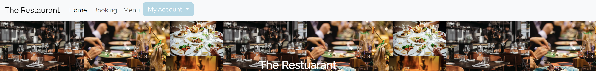
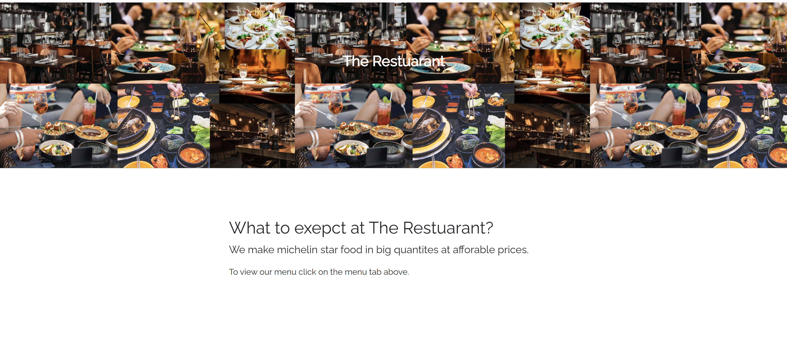

# The Restaurant
## Live website Url:
https://the-restaurant.herokuapp.com/

Welcome to The Restaurant.  We offer all the best trending dishes at a Michelin star level at the fraction of the price. We aim to be able to give a taste of culture from all over the world. By providing Customers with A selection of expertly created dishes we hope that we can provide a place where families can meet, friends can bond, and strangers can get along comfortably. We have personally made sure that our restaurant is accessible by all.

## **User Stories:**
### Using Agile

## **Features** 
####  **Navigation Bar:**
* This has all the elements to be able to navigate across the website. This includes  a _**Home**_ button, _**Booking**_ button, _**Menu**_ button,_**Sign-up**_ button and lastly a _**login**_ button. These features are so that the user is able to navigate across the website seamlessly.

#### **landing page:**
 * The landing page describes a about the restaurant while displaying images of the restaurant
 

#### **Footer:**
 * The footer has a couple of features that include links to sign up or login in if the user is not logged im, if the user is logged in it will show links to the bookings page.
  
   

 #### **Booking Page:**
 * The booking page is for users that have created an account or logged in , to fill out a form that allows them to enter their name, email ,phone, special requirements, date, time, so they are able to book at our restaurant  
 
 
 #### **Menu:** 
 * The menu page is to display the lists of food we sell at our restaurant, it gives a insight into the pricing and selection of beverages, meals and deserts available.
  

 #### **Sign-up Page**
 * 

 #### **My bookings Page**
 * 
 #### **Sign-out Page**
 * 

 #### **login Page**

 ## **Technologies Used:**

 ## **Languages**:
* Python - Provides the functionality for the site.
* HTML5 - Provides the content and structure for the website.
* CSS3 - Provides the styling for the website.
* JavaScript - Provides interactive elements of the website

# **Testing:*
# **Testing:** 

## **HTML Vaildator** 
NO errors or bugs found within the code. Validated on Official W3C Validator - [CLICK HERE]()   

## **CSS Validator**
NO errors found within CSS code. Validated by  Official Jigsaw - [CLICK HERE]()

 # CRUD functionality
### Add a Booking
*  Create or 'add' Booking by filling out the Form on the booking page.

### Update a Booking
*  Update or 'edit'a booking by clicking on the edit button found within the my bookings page.

### Delete a Booking
* Delete or 'remove' a booking by clicking on the Delete button found within the my bookings page.

# Acknowledgements and Credits
*code institute 
*django docs
*stack overflow